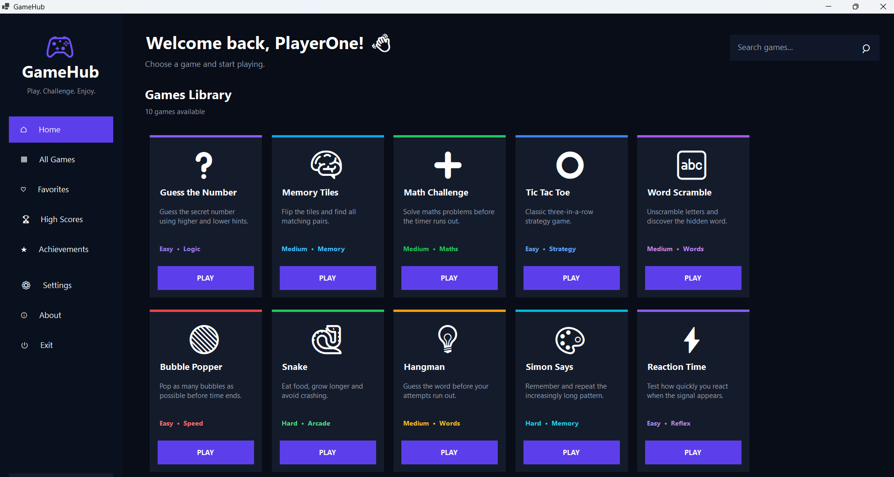
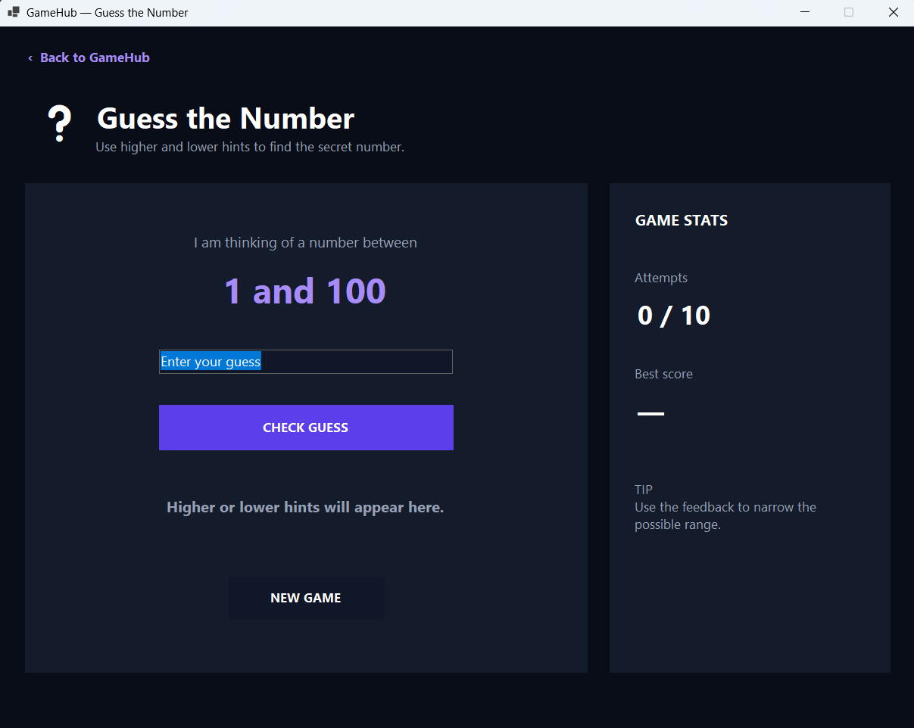
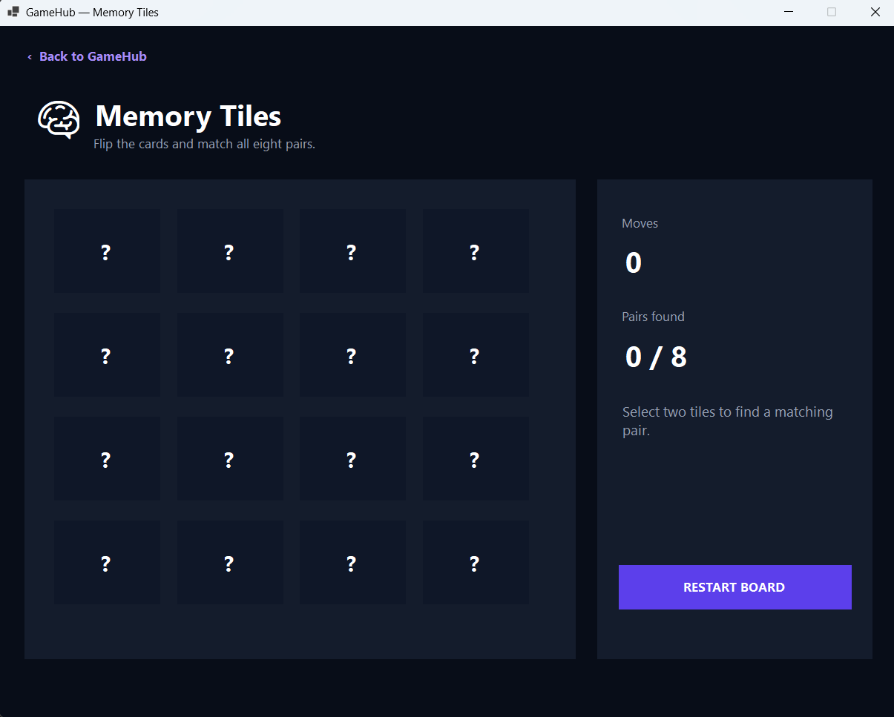
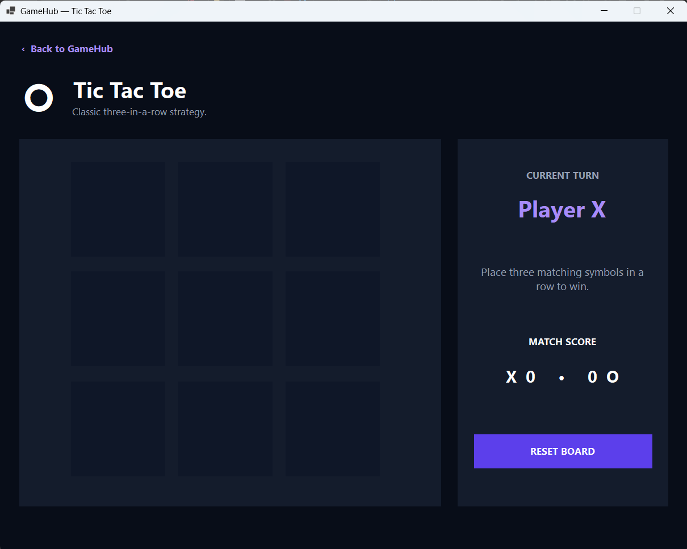
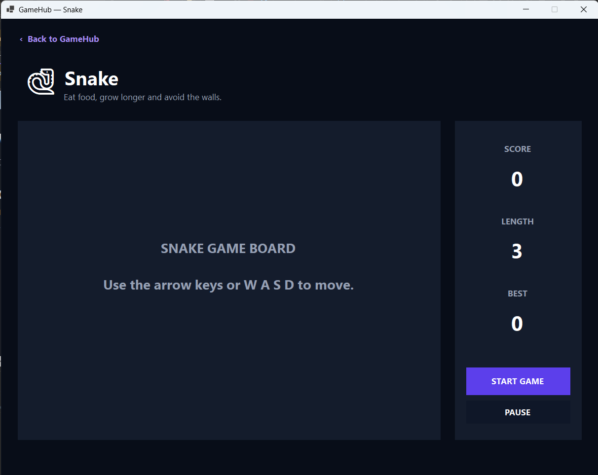
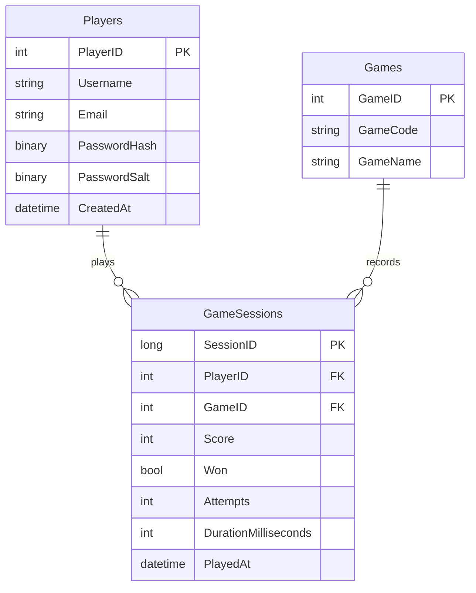

<div align="center">

# 🎮 GameHub

### A C# Windows Forms Desktop Arcade

A collection of ten mini-games with player accounts, score tracking, statistics, achievements, and leaderboards.


**Developed by Ashley Ashirai Hlatshwayo — GHOSTTECH.Ashirai**

</div>

---

## 📖 About GameHub

**GameHub** is a C# Windows Forms desktop arcade that brings several small games together in one application.

The project uses a consistent dark-themed interface and is planned to include:

- Player registration and login
- Player profiles
- Score calculation
- Game history
- Personal best scores
- Global leaderboards
- Player statistics
- Achievements and progression

GameHub is being developed as a personal learning and portfolio project.

---

## 🚧 Project Status

> GameHub is currently under active development.

The following parts have been started:

- ✅ Main GameHub dashboard interface
- ✅ Guess the Number interface
- ✅ Initial Guess the Number game logic
- 🎨 Memory Tiles interface design
- 🎨 Tic Tac Toe interface design
- 🎨 Snake interface design
- 🚧 Guess the Number scoring
- 🚧 Microsoft SQL Server database
- 📋 Player registration and login
- 📋 Score tracking and leaderboards
- 📋 Remaining game logic

---

## 📸 Screenshots

### Main Dashboard

The main dashboard provides access to the complete GameHub games library, player profile, statistics, achievements and settings.



### Game Interfaces

| Guess the Number | Memory Tiles |
|---|---|
|  |  |

| Tic Tac Toe | Snake |
|---|---|
|  |  |

> Some interfaces shown above are still design previews. Their complete game logic and database tracking will be added during development.

---

## 🕹️ Games

| # | Game | Category | Difficulty | Status |
|---:|---|---|---|---|
| 1 | ❓ Guess the Number | Logic | Easy | 🚧 In development |
| 2 | 🧠 Memory Tiles | Memory | Medium | 🎨 UI designed |
| 3 | ➕ Math Challenge | Mathematics | Medium | 📋 Planned |
| 4 | ⭕ Tic Tac Toe | Strategy | Easy | 🎨 UI designed |
| 5 | 🔤 Word Scramble | Words | Medium | 📋 Planned |
| 6 | 🔵 Bubble Popper | Speed | Easy | 📋 Planned |
| 7 | 🐍 Snake | Arcade | Hard | 🎨 UI designed |
| 8 | 💡 Hangman | Words | Medium | 📋 Planned |
| 9 | 🎨 Simon Says | Memory | Hard | 📋 Planned |
| 10 | ⚡ Reaction Time | Reflex | Easy | 📋 Planned |

---

## ✨ Planned Features

### Player Accounts

- Create a new GameHub account
- Log in using a username and password
- Secure password hashing
- Personal player profile
- Account creation date
- Last login tracking

### Game Tracking

- Record every completed game
- Record the player's score
- Record the number of attempts
- Record whether the player won
- Record how long the game lasted
- View complete game history

### Scores and Statistics

- Personal best score for every game
- Global high-score leaderboards
- Total games played
- Total games won
- Average score
- Player win rate
- Recent game results

### Achievements

- First game completed
- First game won
- New personal best
- Perfect game
- Winning streaks
- Game-specific achievements

---

## 🛠️ Technologies

| Technology | Purpose |
|---|---|
| C# | Application and game logic |
| Windows Forms | Desktop user interface |
| .NET | Application framework |
| Microsoft SQL Server | Player and game data storage |
| T-SQL | Database tables, queries, views and procedures |
| Microsoft.Data.SqlClient | Communication between C# and SQL Server |
| Visual Studio | Development environment |
| Git | Source control |
| GitHub | Repository and project hosting |

---

## 🗄️ Planned Database

GameHub will use one shared Microsoft SQL Server database for all ten games.

### Main Tables

| Table | Purpose |
|---|---|
| `Players` | Stores registered GameHub accounts |
| `Games` | Stores information about the available games |
| `GameSessions` | Stores every completed game and its result |

High scores will be calculated using the results stored in the `GameSessions` table. This prevents unnecessary duplicate score information.

### Database Relationship



---

## 📁 Suggested Project Structure

```text
GameHub/
├── Database/
│   └── GameHubDatabase.sql
│
├── Data/
│   ├── DatabaseConnection.cs
│   └── GameTrackingService.cs
│
├── GameLogic/
│   ├── GuessNumberGame.cs
│   ├── MemoryTilesGame.cs
│   ├── MathChallengeGame.cs
│   ├── TicTacToeGame.cs
│   └── ...
│
├── Models/
│   ├── Player.cs
│   └── GameResult.cs
│
├── Screenshots/
│   ├── GuessNumber.png
│   ├── MainDashboard.png
│   ├── MemoryTiles.png
│   ├── Snake.png
│   └── TicTacToe.png
│
├── Services/
│   ├── AuthenticationService.cs
│   ├── PasswordHasher.cs
│   └── HighScoreService.cs
│
├── MainForm.cs
├── MainForm.Designer.cs
├── GuessNumberForm.cs
├── GuessNumberForm.Designer.cs
├── Program.cs
├── GameHub.csproj
└── GameHub.sln
```

> The project structure may change as development continues.

---

## 💻 Getting Started

### Requirements

Before running GameHub, install:

- Visual Studio 2022 or newer
- The **.NET desktop development** workload
- Git
- Microsoft SQL Server or SQL Server Express
- SQL Server Management Studio

---

## 📥 Clone the Repository

Open Git Bash, Command Prompt or the Visual Studio terminal:

```bash
git clone https://github.com/Ashirai29/GameHub.git
```

Move into the project folder:

```bash
cd GameHub
```

Open the solution:

```bash
start GameHub.sln
```

You can also open `GameHub.sln` manually using Visual Studio.

---

## ▶️ Run the Application

1. Open `GameHub.sln` in Visual Studio.
2. Allow Visual Studio to restore the NuGet packages.
3. Confirm that `GameHub` is the startup project.
4. Build the solution.
5. Press `F5` or select **Start**.

Database-dependent features will require a valid SQL Server connection after they have been implemented.

---

## 🌿 Development Workflow

Create a different branch for each feature.

### Create a Feature Branch

```bash
git checkout master
git pull origin master
git checkout -b feature/name-of-feature
```

Example:

```bash
git checkout -b feature/guessNumberGame
```

### Save Your Work

```bash
git add .
git commit -m "Complete Guess the Number game logic"
git push -u origin feature/guessNumberGame
```

A feature branch does not need to be deleted while it is still being used.

When the feature is complete, it can be merged into `master` through a pull request.

---

## 🗺️ Roadmap

- [x] Create the main dashboard design
- [x] Create the Guess the Number interface
- [x] Add the initial Guess the Number logic
- [x] Create the Memory Tiles interface
- [x] Create the Tic Tac Toe interface
- [x] Create the Snake interface
- [ ] Complete Guess the Number scoring
- [ ] Create the SQL Server database
- [ ] Add player registration
- [ ] Add player login
- [ ] Add secure password hashing
- [ ] Add shared game-tracking services
- [ ] Connect Guess the Number to the database
- [ ] Create the high-score page
- [ ] Create the player statistics page
- [ ] Implement Memory Tiles game logic
- [ ] Implement Math Challenge
- [ ] Implement Tic Tac Toe game logic
- [ ] Implement Word Scramble
- [ ] Implement Bubble Popper
- [ ] Implement Snake game logic
- [ ] Implement Hangman
- [ ] Implement Simon Says
- [ ] Implement Reaction Time
- [ ] Add achievements and progression
- [ ] Test the complete application
- [ ] Publish the first GameHub release

---

## 🤝 Contributing

GameHub is currently a personal learning and portfolio project.

Suggestions, bug reports and constructive feedback are welcome through GitHub issues.

If contributions are opened in the future:

1. Fork the repository.
2. Create a feature branch.
3. Make and test your changes.
4. Commit your changes.
5. Push your branch.
6. Submit a pull request.

---

## 👤 Author

### Ashley Ashirai Hlatshwayo

**GHOSTTECH.Ashirai**

- GitHub: [@Ashirai29](https://github.com/Ashirai29)
- Project: [GameHub](https://github.com/Ashirai29/GameHub)

---

## 📄 Licence

This project is licensed under the **MIT Licence**.

See the [`LICENSE.txt`](LICENSE.txt) file for complete licence information.

---

<div align="center">

### 🎮 GameHub

**Play. Compete. Improve.**

Made with C# and determination by **GHOSTTECH.Ashirai**

</div>
